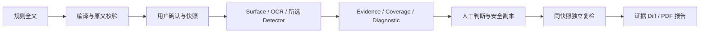

# 净稿

科研竞赛材料智能合规助手。用于提交前自查，帮助把规则、真实文档证据和整改复检放在一起。

[](https://github.com/3331083641-prog/jinggao/actions/workflows/ci.yml)

核心能力：规则原文编译与确认、STRICT_CUSTOM 隔离、本地 OCR、真实证据定位、检测覆盖、安全整改副本、独立复检与证据级 Diff、PDF 报告。保留六页界面与首页 Three.js 品牌场景。

产品截图在本机运行浏览器验收后生成于 `review_screenshots/competition-upgrade/`，不发布用户文档截图或未经授权的设计参考图。可按下方 Quick Start 直接体验真实界面。

## 核心问题与能力

匿名评审与科研竞赛的要求散落在格式说明、模板和附件中，正文以外还可能保留属性、批注和隐藏内容。净稿支持 PDF / DOCX / PPTX / TXT / MD，导入 PDF / DOCX / TXT / MD 规则（旧 DOC 可选使用本机 Word 转换），提供原文证据、规则溯源、连续阅读、独立 Run 复检与 PDF 报告。

流程：导入规则 → 确认条款 → 上传材料 → 检测 → 定位证据 → 人工判断 → 整改后复检 → 导出报告。规则与报告可以删除；删除报告不删除原始检测证据。

## Quick Start

需要 Python 3.12 和 Node.js 22.12+。首次安装需要联网下载依赖；之后材料处理在本机进行。

```powershell
python -m venv backend/.venv
backend/.venv/Scripts/python.exe -m pip install -r backend/requirements.lock.txt
npm.cmd --prefix frontend ci
```

两个终端分别启动：

```powershell
backend/.venv/Scripts/python.exe -m uvicorn app.main:app --app-dir backend --host 127.0.0.1 --port 8000
npm.cmd --prefix frontend run dev
```

打开 http://127.0.0.1:5173 。数据库自动建表，不需要用户数据库。`JINGGAO_DATA_DIR` 和 `JINGGAO_API_ORIGIN` 可以覆盖本地目录与代理；配置样例不会自动加载，不含密钥。

## 规则机制

自定义规则使用 `STRICT_CUSTOM` 白名单模式。只执行当前选择的 RuleSet 中的规则，不加入匿名评审、学术投稿或其他默认规则。多选规则时，只联合明确选中的规则，保留每项来源和原文。内置规则仅在用户选中时执行，不冒称赛事官方要求。

规则文件完整解析并保存来源结构。明确要求映射为可执行 Schema；未实现的要求、条件与例外保留原文，交给用户确认和人工核对。标题、年份、背景介绍不会自动成为规则。确认后才保存生效；**不声称已经自动理解所有自然语言规则**。单次最多 100 项，超出明确报错，不截断条款。

每个 Run 保存规则快照、`rule_set_id`、`rule_ids_executed`、`detectors_executed` 和执行模式。每个合规 Finding 关联当前 Rule，Rule 保留 `original_text`、来源文件、真实来源页码（可取得时）、章节及范围。无法确定的 DOCX 页码不会编造。

编译器先对完整抽取文本确定性提取，再为每条原文建立条件、例外、目标、范围和溯源。可选本地 LLM 只能提出语义注释，不增加条款、扩大范围或改变检测参数；校验不通过即退回确定性草案。只接受 loopback 地址；**默认不调用任何 LLM，不连接 OpenAI/Claude/Gemini，不上传材料到公网**。没有 LLM 时全部主要流程可运行。配置与边界见 [RULE_COMPILER](docs/RULE_COMPILER.md)。

## 检测、整改与报告

“检测覆盖”默认折叠，逐条显示 VERIFIED / PARTIAL / MANUAL / UNAVAILABLE；VERIFIED 是实现范围已检查，不等于合规 PASS。图像语义、启发式实体和 OCR 原图字形不能冒称完整覆盖。

整改 Tab 可选择清理、预览结构变化、生成 `filename.cleaned.ext` 并自动复检。同一规则快照与范围产生 Run N+1，原文件 SHA 不变。PDF 只清理安全元数据；DOCX/PPTX 清理支持的 Office 结构。修订只移除作者/日期，保留内容；正文身份、公式、引用、图片不自动改。加密、签名、表单 PDF、带宏/签名 Office 拒绝自动修改。见 [CLEANUP_ENGINE](docs/CLEANUP_ENGINE.md)。

Diff 保留旧、新 Evidence，区分消失、仍存在、新增和状态转换。仅同快照、同范围、已完成且新检查 VERIFIED + 实际 PASS 才列为“转通过”。PDF 报告含原文规则、来源、覆盖、人工记录、系统诊断、整改和 Diff；局部截图只来自已验证 PDF 坐标。

## PASS / REVIEW / FAIL

- **FAIL**：当前规则范围中有明确违反证据。
- **REVIEW**：当前条款有需要人核对的命中、条件或未实现语义要求。
- **PASS**：确定性检查在已验证范围内通过，不表示全文绝对安全。

解析缺口、OCR 故障等属于 `SYSTEM_DIAGNOSTIC`，独立显示，不计入合规 Finding 数量。诊断未解决或启发式实体规则未能完整验证时，Run 不冒称通过。

OCR 置信度单独偏低不产生 REVIEW。质量分析依据替换字符、缺字框、损坏字符等证据；小字号、图表、专业术语和普通中英文不因置信度判问题。学校文字、AI 标识、Logo 检查必须有对应生效规则。图形 Logo 识别仍有限制，不能把每张图片当作命中。

## 文档阅读

工作台 PDF 使用连续纵向阅读。所有页面都有位置占位，只在视口附近创建 PDF Canvas；缩略图可连续滚动，阅读页码双向同步。点击问题滚动到对应页与真实 bbox，定位后仍可自由阅读。文档、缩略图和问题列表独立滚动。

## 技术架构

React 19 + TypeScript + Vite → FastAPI → SQLite WAL。PDF.js 预览；pdfplumber / pypdf 和 OOXML 提取真实 Surface；RapidOCR ONNX 在本机识别文字；规则驱动 Detector；ReportLab 导出报告。scikit-learn 仅提供局部语境辅助，不能授权新增规则或改写检测结论。首页 Three.js Hero 与业务检测分离。



自主增量是规则授权边界、可验证覆盖、安全副本和证据闭环；开源 OCR 承担真实神经网络推理。可选本地语义/视觉 Provider 未随仓库附带模型，不宣称其已达到通用规则理解或 Logo 识别精度。

## 测试

```powershell
backend/.venv/Scripts/python.exe -m pytest -q
backend/.venv/Scripts/python.exe -m ruff check backend/app tests
npm.cmd --prefix frontend run lint
npm.cmd --prefix frontend run typecheck
npm.cmd --prefix frontend run build
npm.cmd --prefix frontend run test
```

首次浏览器测试先安装 Chromium 到项目缓存：

```powershell
$env:PLAYWRIGHT_BROWSERS_PATH = "$PWD/.cache/playwright"
node frontend/node_modules/@playwright/test/cli.js install chromium
```

测试使用独立数据库和合成材料，覆盖规则隔离、真实 OCR、上传、删除、复检、报告、89 页连续阅读和 95 项独立滚动。`tests/build_review_fixtures.py` 可生成合成阅读与 OCR 样例；读取本机字体但不复制分发字体。

GitHub Actions 分别执行后端 pytest/Ruff/Benchmark、前端格式/类型/构建及关键浏览器闭环。完整浏览器套件在本机运行，保留 1920×1080、1440×900、1366×768 验收。具体运行记录见 [TEST_REPORT](docs/TEST_REPORT.md)。

## Benchmark

原 `benchmark/results.json` 保留。`backend/.venv/Scripts/python.exe benchmark/v2.py` 生成 `results_v2.json`：56 条合成句、30 个实际 PDF/DOCX/PPTX，包含身份、属性、隐藏、批注、修订、图片文字、水印与正常小字/图表。

候选召回（FAIL+REVIEW）和确定 FAIL 分开统计；未判 FAIL 的人工候选不冒称最终识别成功。原图损坏字形可能被 OCR 忽略，漏检保留，PARTIAL 不算 PASS。公开指标、误报漏报和边界见 [BENCHMARK_V2](docs/BENCHMARK_V2.md)，不能外推真实赛事材料准确率。

## 本地隐私与发布边界

原始材料、SQLite、OCR 结果和报告留在本机，不上传云端 AI。源代码仓库不含真实比赛材料、用户文档、数据库、密钥、权重、依赖目录或本机缓存。源码发布与含二进制/权重的离线安装包发布分开审计。

第三方边界见 [开源清单](docs/OPEN_SOURCE_MANIFEST.md)、[许可审计](docs/OPEN_SOURCE_LICENSE_AUDIT.md)。上游依赖仍适用其原许可证，未修改上游源码。当前公开源码供审查；自主源码拟采用 MIT，但权利和历史权重来源链尚待最终确认，暂未建立根 LICENSE。公开仓库不等同于已完成全部开源授权。

## 项目结构

```text
frontend/src/        页面、连续阅读、Three.js Hero
backend/app/         Schema、解析、检测器、任务、SQLite、报告
benchmark/fixtures/ 合成 PDF / Office 样例
tests/              单元、API、OCR、Playwright 测试
scripts/             启动、合成验证、发布审计
docs/               架构、开源披露、比赛对应与测试说明
```

## 已知限制

规则提取是可审查的条款映射，不是完整法律/赛事语义理解。独立创新、AI 使用真实性及复杂条件需人工判断；不根据缺少关键词直接断定违规。OCR 不能证明每个字符都正确，普通无意义语言、严重模糊和图形 Logo 无法可靠完整自动判断。DOCX 预览不等同于 Word 排版，PPTX 提供真实表层而非像素级预览。单文件 50 MB、PDF 150 页、OCR 最多 80 个图像区域，超出会明确给出诊断。当前用于本机运行，不是公网多用户服务。

## 比赛说明

项目面向 AI + 开源应用创新，强调可运行的规则—证据—整改流程。神经网络 OCR 与开源工具参与真实处理，自研规则隔离、证据映射、独立复检和质量策略。比赛要求与贡献边界见 [COMPETITION_ALIGNMENT](docs/COMPETITION_ALIGNMENT.md)；合成测试指标不外推为真实世界准确率。
