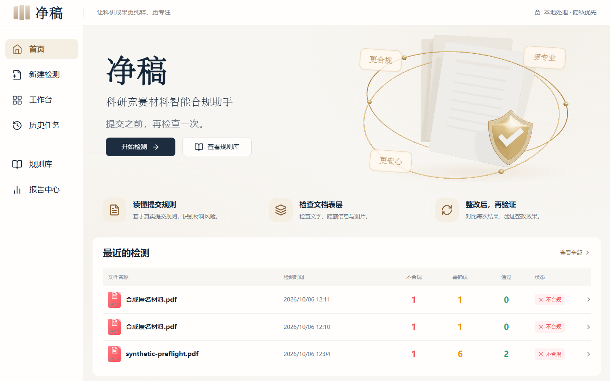
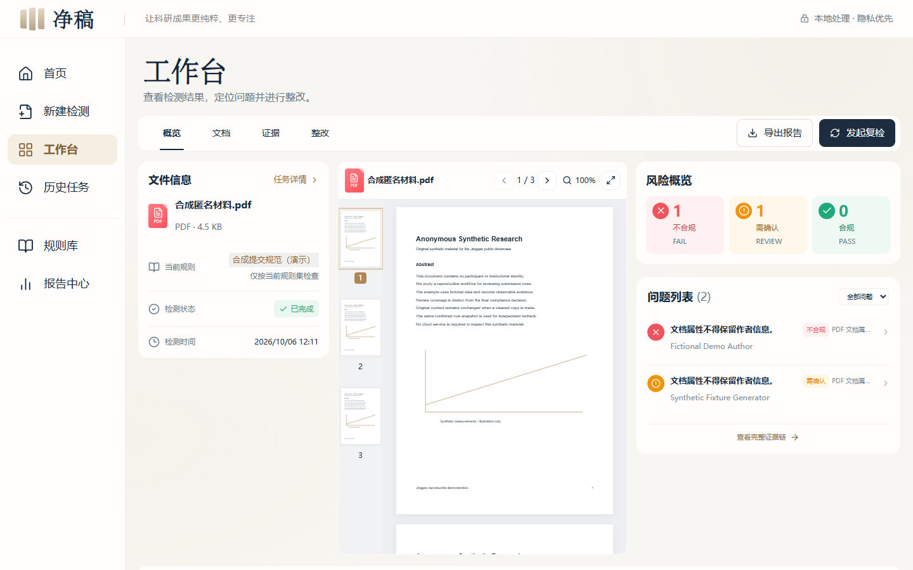
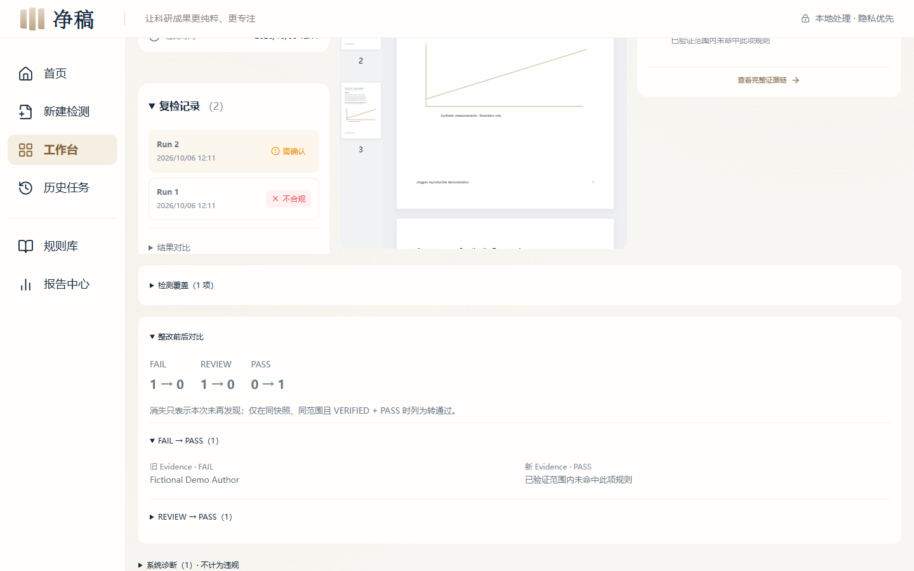
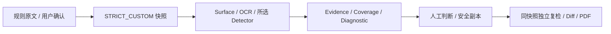

# 净稿

科研竞赛材料智能合规助手。把规则、证据、整改和复检放进同一条可信链路。

**规则 → 材料 → Evidence → 整改 → 复检 → 报告**

[](https://github.com/3331083641-prog/jinggao/actions/workflows/ci.yml)

三张截图均为真实运行界面，使用原创合成材料与独立数据库，未使用设计稿或真实比赛文件。





## 评委快速体验：Windows 一键启动

下载并解压仓库，在根目录 PowerShell 执行：

```powershell
.\start.ps1
```

或双击 **启动净稿.cmd**（英文别名 `start-jinggao.cmd`）。首次自动准备项目依赖，启动后打开 [净稿首页](http://127.0.0.1:5173/)；重复执行会复用当前实例。停止：`.\stop.ps1`。错误日志在 `runtime/launcher/logs/`。端口被其他程序占用时明确报错，不杀进程。

## 首次安装前置条件

Windows 10/11、[Python 3.12（64位）](https://www.python.org/downloads/windows/)、[Node.js 22.12+（含 npm）](https://nodejs.org/en/download)，可写的仓库目录；支持中文与空格路径。

**首次安装需要网络下载锁定依赖。默认不需要 API Key，不需要 Qwen/Ollama；材料在本地处理，GitHub 不包含个人用户数据库或上传材料。** 不静默安装系统软件、不修改 PATH、不永久修改执行策略、不要求管理员。无 Python/Node 且无网络的电脑无法直接运行源码。Windows 安全提示应先核对仓库来源并遵循组织策略，不关闭系统保护。

初始化、停止、端口冲突、日志与开发说明见 [Windows 启动指南](docs/WINDOWS_START.md)。依赖完整后主要流程可以离线使用。

## 三分钟演示流程

1. 规则库导入 `demos/metadata-rule.txt`，查看原文、确认保存，点击“使用该规则”。
2. 上传已有合成素材 `benchmark/fixtures/synthetic-cleanup.pdf`，运行真实检测。
3. 查看 Evidence 和 Coverage；在“整改”Tab 预览元数据清理，生成副本并复检。
4. 查看 Run N / N+1 的旧新 Evidence Diff，下载副本和 PDF 报告。

不会预置假结果或自动处理评委私人文件。原稿保持不变，复检沿用相同规则快照。详细步骤和本地模型“未配置 / 可用 / 失败”解释见启动指南。

## 核心功能

| 能力 | 实现 |
|---|---|
| 规则原文编译 | 全文提取、来源映射、用户确认、STRICT_CUSTOM 快照 |
| 本地 OCR | RapidOCR / ONNX，低 confidence 本身不报风险 |
| 文档与证据 | PDF/DOCX/PPTX/TXT/MD，Document Surface、连续 PDF 阅读、定位 |
| Coverage | VERIFIED / PARTIAL / MANUAL / UNAVAILABLE，独立于违规结论 |
| 安全整改 | 预览、副本、格式重开校验，不覆盖原稿 |
| 复检 Diff | 同规则快照独立 Run，保留旧新 Evidence |
| PDF 报告 | 规则、覆盖、证据、人工判断、诊断和整改对比 |
| 本地隐私 | SQLite WAL；可选 LLM/VLM 仅 loopback，默认无云 AI |

## 技术架构

React / TypeScript / Vite + FastAPI + SQLite WAL；PDF.js 惰性连续阅读，RapidOCR 本机推理，Three.js 只用于首页品牌 Hero。数据库启动时自动初始化，不复制用户数据。



[架构](docs/ARCHITECTURE.md) · [五个创新点](docs/INNOVATION.md) · [比赛对应](docs/COMPETITION_ALIGNMENT.md)

## 自定义规则与安全边界

用户选择什么规则就执行什么规则，多选只联合选中条款；不混入未选择的匿名/投稿规则。每个 Run 保存原文、来源、快照、执行规则 ID 和 Detector。模型只能注释原文，不能新增规则、扩大 scope 或删除例外；未配置时确定性 fallback 可运行，不调用公网 AI。

FAIL 需要明确证据；REVIEW 是具体候选。**Unknown ≠ Clean；Coverage VERIFIED 不等于 PASS。** 系统解析/OCR错误单独记 SYSTEM_DIAGNOSTIC。条件和例外不能可靠验证时保留 MANUAL。安全清理不自动删正文身份、技术内容、公式、引用或图片；PDF 仅安全元数据，Office 按支持结构清理，修订内容保留。

[Rule Compiler](docs/RULE_COMPILER.md) · [整改引擎](docs/CLEANUP_ENGINE.md) · [Coverage](docs/COVERAGE_MATRIX.md)

## 测试与 Benchmark

[测试报告](docs/TEST_REPORT.md) · [启动验收](docs/JUDGE_LAUNCH_TEST_REPORT.md)。CI 执行核心测试、构建和确定性评测；完整浏览器测试命令在启动指南，评委启动不下载浏览器测试环境。

v1/v2 保留；另有 60 条 Rule Compiler 评测与 120 句＋84 文档冻结合成 Hold-out。候选与确定 FAIL 分开统计，公开 FP/FN，PARTIAL 不算 PASS。合成标签由 Codex 编写，尚待团队人工复核，不是外部人工盲测。真实本机 Ollama/Qwen3.5 4B 实验没有提高执行指标，模型建议大量未通过格式校验，不宣称完整理解规则。

[Rule Compiler Evaluation](docs/RULE_COMPILER_EVALUATION.md) · [Hold-out](docs/HOLDOUT_BENCHMARK.md) · [Benchmark v2](docs/BENCHMARK_V2.md)

## 已知限制

- 目标、范围与例外提取仍有误差，必须确认；模型不是裁判。
- 引用/公开背景存在实体误报及漏检；纯图形 Logo 仅 REVIEW 候选，覆盖 PARTIAL。
- OCR 会漏掉部分损坏字形；正常小字、中英文和图表不因低 confidence 单独报风险。
- DOCX 不编造页码；PPTX 是表层预览，不是像素级重建；不可验证 bbox 时不伪造截图。
- 单文件 50 MB、PDF 150 页、OCR 最多 80 区域；缺失覆盖明确诊断。
- 本机应用，不提供公网多用户服务或全自动匿名保证；Windows GUI 双击/安全弹窗需人工验收。

## 开源许可证与第三方资源

自主源码拟采用 MIT，但仍等待团队版权及共同权利人授权，**根 LICENSE 和正式 Release 尚未创建**。第三方依赖、模型权重、字体、参考图和用户文件不受候选 MIT 覆盖；二进制安装包需另审计。本仓库不分发外部 LLM/VLM 权重、用户材料或系统字体。

[LICENSE_SCOPE](docs/LICENSE_SCOPE.md) · [许可审计](docs/OPEN_SOURCE_LICENSE_AUDIT.md) · [开源清单](docs/OPEN_SOURCE_MANIFEST.md) · [AI 使用说明](docs/AI_TOOL_USE.md) · [发布清单](docs/RELEASE_CHECKLIST.md)
