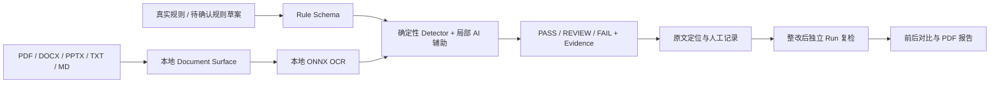

# 净稿

**科研竞赛材料智能合规助手 · 提交之前，再检查一次。**

面向匿名评审、科研竞赛提交与学术投稿，检查正文之外容易被遗漏的作者属性、页眉页脚、批注、修订、隐藏文字、链接与图片文字。每个结果提供规则依据、真实证据、位置和整改建议，整改后重新上传并保留每次检测记录。

全新工程，工作目录 `D:\jinggao`；未以旧项目为代码基座。没有登录、账号、订阅或商业后台。

## 核心流程



PASS 只表示该项规则在已验证范围通过。模糊身份、未知检测器、未启用范围、解析失败或缺失覆盖均需要 REVIEW；零命中不能证明完全匿名。

## 快速启动（Windows，Python 3.12 / Node 22+）

```powershell
cd D:\jinggao
python -m venv backend\.venv
backend\.venv\Scripts\python.exe -m pip install --index-url https://pypi.org/simple -r backend\requirements.lock.txt
cd frontend
npm.cmd ci
cd ..
powershell -NoProfile -ExecutionPolicy Bypass -File scripts\start.ps1
```

浏览器：<http://127.0.0.1:5173>；后端健康检查：<http://127.0.0.1:8000/health>；API 文档：<http://127.0.0.1:8000/docs>。

需要查看实时开发日志时，在两个终端分别运行：

```powershell
cd D:\jinggao\backend
.venv\Scripts\python.exe -m uvicorn app.main:app --host 127.0.0.1 --port 8000
```

```powershell
cd D:\jinggao\frontend
npm.cmd run dev
```

启动顺序：后端 `/health` → 上传至 `/generate` 验证 → 前端 `npm run dev` → 浏览器实际操作。`scripts/start.ps1` 不自动向生产任务写入测试材料；开发验收脚本单独执行真实上传。

## 演示

1. 新建检测，上传自己的 PDF 或 DOCX，选择基础规则或已确认的真实提交规范。
2. 查看真实阶段进度；OCR 仅在存在图片 / 扫描页且启用该范围时运行。
3. 工作台点击证据，PDF 自动跳页并突出真实 bbox；DOCX 原文 / 部件定位。
4. 证据链记录人工判断，修改原材料，再上传复检。人工记录不会把旧证据自动改成 PASS。
5. 在工作台对比 Run，导出真实中文 PDF 报告。

合成演示材料可自行生成：`backend\.venv\Scripts\python.exe benchmark\generate_fixtures.py`。测试资料明确标为合成材料，不自动填入生产历史。

## 架构与目录

React + TypeScript + Vite / React Router / TanStack Query / Lucide / Framer Motion；FastAPI / Python；SQLite WAL。

- `frontend/src/components`：自研 Shell、SVG Hero、PDF/DOCX 预览、证据卡片。
- `frontend/src/pages`：首页、新建检测、扫描/工作台、证据、规则、历史、报告。
- `backend/app/parsers`：PDF 与 OOXML 表层抽取；`detectors`：规则驱动检测；`services`：OCR / 语义辅助；`tasks`：运行与真实进度；`reports`：PDF 生成。
- `backend/data`：本机 SQLite、原文件与报告，默认不进入 Git。
- `tests`、`benchmark`：可复现验证；`review_screenshots`：三个桌面尺寸的浏览器截图。
- `docs`：架构、比赛对应、创新、开源清单、许可审计、AI 使用、测试与演示说明。

## 测试与构建

```powershell
cd D:\jinggao
backend\.venv\Scripts\python.exe benchmark\generate_fixtures.py
backend\.venv\Scripts\python.exe -m pytest -q
backend\.venv\Scripts\python.exe benchmark\evaluate.py
cd frontend
$env:PLAYWRIGHT_BROWSERS_PATH='D:\jinggao\.cache\playwright'
npx.cmd playwright install chromium
npm.cmd run test:e2e
npm.cmd run build
```

E2E 使用隔离数据目录与 8001/5174 端口，不修改生产材料。参见 [测试记录](docs/TEST_REPORT.md) 与 [基准结果](benchmark/results.json)。

当前版本范围见 [完成度报告](docs/CURRENT_COMPLETION.md)。参考图与实际截图见 [视觉对照](docs/VISUAL_COMPARISON.html)。本机服务真实上传验收可显式执行 `backend\.venv\Scripts\python.exe scripts\verify_local.py`，会保存标注为 synthetic 的测试任务和两个 Run；日常启动不会自动创建示例任务。

## 开源、自主实现与许可证

自研内容：统一 Rule/Surface、中文 Recognizer、证据与覆盖缺口策略、独立 Run 复检、人工记录、报告和全部核心 UI。开源 AI 承担本地 OCR、规则草案和局部语境辅助；不是仅调用通用大模型 API。

详细资源披露见 [开源清单](docs/OPEN_SOURCE_MANIFEST.md)、[许可审计](docs/OPEN_SOURCE_LICENSE_AUDIT.md)、[AI 工具说明](docs/AI_TOOL_USE.md)。第三方库未修改，来源与版本已盘点。当前仍有历史 OCR 权重及二进制再分发的审计事项，故暂未建立根 LICENSE；自主源码候选 MIT，当前没有公开发布或上传仓库。

## 第一版限制

- 单文件 50 MB；PDF 150 页；OCR 最多 80 个图像区域。本地处理可能耗时，不使用假进度。
- OCR 可识别文字；Logo 图形语义仍人工复核。Qwen3-VL 尚未集成。
- 中文 Recognizer 是词法与上下文启发式；英文机构、机构别名、无标签姓名、固定电话可能漏检，通过覆盖 REVIEW 暴露限制。小型分类模型只做辅助。
- PDF 隐藏图层、透明文字、矢量文字、附件；OOXML 样式继承的隐藏内容、离页图形、嵌入对象内部未完整覆盖。
- DOCX 不推测页码；浏览器版式不承诺与 Word 完全一致。PPTX 为真实表层预览，不是 PowerPoint 像素级预览。
- 内置规则是自查建议，不冒称任何赛事/期刊官方标准。导入规范须逐条确认。
- 本机服务不提供公网多用户部署能力。文件本地保存，不自动清理；请用合成材料演示，生产数据不纳入发布包。
